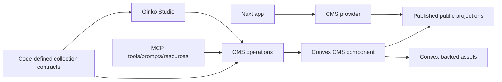

# Ginko CMS Architecture

Ginko CMS is a self-hosted CMS/admin layer for Ginko-powered Nuxt websites. The
core architecture is intentionally narrow: code-defined content models, a
Convex-backed CMS implementation, a standalone Studio app, published read
projections, and provider integration with Ginko core.

## Package Boundaries

The v1 architecture has three packages:

- `@lupinum/ginko-cms`: Nuxt module, Studio host, auth pages, public API routes,
  filesystem migration tooling, CMS provider integration, and the bridge
  manifest used during setup.
- `@lupinum/ginko-cms-contract`: framework-neutral shared domain contracts,
  public-content types, Convex validators, and schema helpers.
- `@lupinum/ginko-cms-convex`: Convex component implementation for content,
  assets, auth integration, public projections, members, settings, imports, and
  MCP-backed operations.

Keep domain contracts free of Nuxt, Vue, Studio, and package implementation
details. Keep the Convex component free of Studio and Nuxt runtime dependencies.
Keep host-generated bridge files thin.

## Runtime Shape



The app defines collections in code. Ginko CMS syncs those contracts into the
CMS as read-only operational truth. Studio and MCP use the contracts to edit and
publish content, but they do not mutate schema.

## Setup Boundary

Trellis powers internal bridge generation, route protection, permissions, and
Convex integration mechanics. Public setup should still feel like Ginko CMS.
Users install and validate Ginko CMS; they should not need to understand Trellis
concepts to build a Ginko CMS site.

The durable rule is:

> Trellis may power internals, but Ginko CMS owns the user-facing installation,
> setup, and validation experience.

## Studio Boundary

Studio is a standalone Vite SPA hosted by the Nuxt module. It is not a Nuxt
layer and should not be treated as part of the host app's public rendering
surface.

The Nuxt module owns:

- the Studio route and host page;
- auth pages and route protection;
- runtime config passed into the Studio host bridge;
- serving the built Studio bundle;
- Tailwind source registration for module-owned UI.

The Studio app owns authenticated CMS workflows: collection inspection, entry
editing, assets, settings, site data, versions, publishing, and diagnostics.

## Public Reads

Public website reads are published-only and website-shaped. They read active
public projections, not draft/editor tables.

The primary Nuxt integration is:

```text
Nuxt site -> CMS provider -> published projections
```

The public HTTP API is a supported integration surface for published reads and
advanced consumers, but it is not the default Nuxt developer experience.

## Admin And Agent Operations

Studio and MCP share the same product boundary:

- inspect contracts;
- operate drafts, localized fields, assets, members, settings, diagnostics, and
  publishing workflows;
- explain public visibility and publish impact;
- avoid raw database/table mutation;
- avoid schema/config mutation.

MCP is a first-class CMS surface, but it is opt-in through module configuration.
Core tables, generated types, and bridge machinery may exist regardless of route
registration; the externally exposed MCP server should not be enabled
implicitly.

## Storage Foundations

Convex is the hard v1 backend foundation for this repo. Better Auth is the hard
v1 auth foundation. Managed assets are Convex-backed for v1.

Raw MDC is the canonical editable body source. Studio editor state, TipTap,
previews, parsed ASTs, table of contents, search text, and public render shapes
are derived/adapted representations.

Relations store stable references. Runtime expansion, depth, and include-style
query APIs are not part of the v1 public contract.
