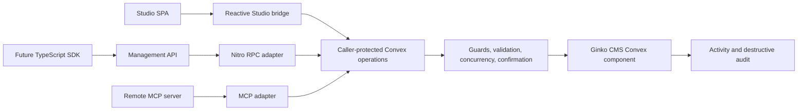
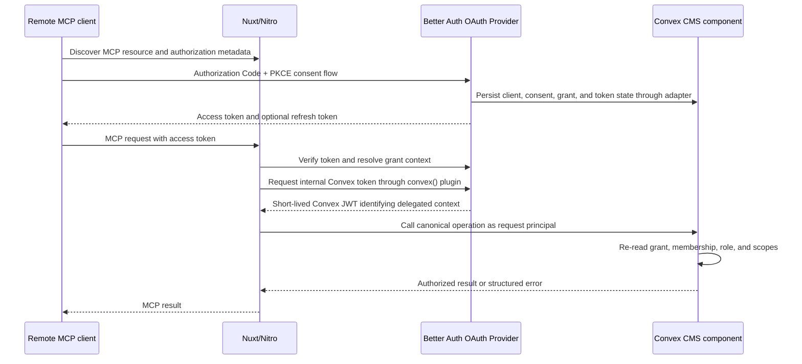

# RFC: The Headless CMS Initiative

- **Status:** Deferred proposal; not part of the accepted greenfield refactor
- **Date:** 2026-07-15
- **Owner:** Matthias
- **Scope:** Ginko CMS management plane across Studio, API, SDK, and MCP
- **Decision horizon:** Pre-1.0 architecture; compatibility promises begin with the stable v1 wire contract

> This RFC is retained as a deferred design exploration. It is not current
> product scope or acceptance evidence. The accepted v1 MCP surface permits
> agents to read, edit drafts, preview impact, and request review only. Direct
> agent publish/archive/restore remains the deferred CND-10 decision, and no
> general management API or SDK is implied by the greenfield refactor.

---

## 1. Summary

The Headless CMS Initiative makes every authorized Ginko CMS management capability available programmatically with the same domain behavior as Studio.

The target architecture is:



Studio, the management API, and MCP are adapters over the same caller-protected Convex functions. A future SDK is a thin client for the management API. No adapter owns CMS business rules, authorization rules, readiness logic, or destructive-operation policy.

This is primarily a consolidation and exposure project, not a new domain framework. The repository already contains the foundations:

- caller-aware protected function wrappers;
- backend permission guards;
- state-bound destructive-operation confirmation;
- draft compare-and-set concurrency;
- MCP credential scope intersection;
- an explicit Studio allowlist that drives both types and runtime exposure;
- a static MCP tool surface;
- run-based portability workflows.

The work is to make those foundations total, define one exposure catalog, add a versioned Nitro management API, add standards-based OAuth for remote MCP interoperability, and prove parity through shared contract tests.

## 2. Decision-status vocabulary

Every material statement in this RFC uses one of four statuses:

| Status             | Meaning                                                                                       |
| ------------------ | --------------------------------------------------------------------------------------------- |
| **Existing**       | Implemented in the repository today and treated as a foundation to preserve.                  |
| **Decided**        | Approved target architecture. Implementation may not exist yet.                               |
| **Spike required** | Direction is bounded, but a named technical uncertainty must be proven before implementation. |
| **Deferred**       | Deliberately excluded from the first implementation sequence until evidence justifies it.     |

An implementation PR must not silently reinterpret a **Spike required** item as **Decided**. It must attach the spike evidence or update this RFC.

## 3. Problem

Ginko CMS already has two management surfaces: Studio and MCP. Their capabilities are not yet described by one complete product contract.

The current risks are:

1. Studio and MCP can expose different wrappers for the same user capability.
2. A future API could become a third handwritten mapping with different validation, errors, or authorization.
3. A future SDK could duplicate backend behavior and become another source of truth.
4. Self-hosted deployments introduce permanent server/client version skew.
5. Bearer API keys are useful for scripts and some MCP clients, but standards-based remote MCP clients require an interoperable delegated authorization flow.
6. Destructive confirmations, draft concurrency, review gates, and activity attribution must survive every transport.
7. Broad claims such as “everything in Studio is headless” are not testable without a precise definition and explicit exceptions.

## 4. Parity definition

### 4.1 Founding criterion

**Decided:** Every authorized Studio management capability must be completable programmatically through at least the management API, and through MCP where agent exposure is safe and useful, with equivalent:

- domain results;
- validation and readiness checks;
- permission decisions;
- concurrency behavior;
- destructive-operation safety;
- stable error meaning;
- activity and audit attribution.

Parity is capability parity, not UI-button parity. A page layout, modal, local preference, keyboard shortcut, reactive subscription, or visual preview may have no headless equivalent. The underlying CMS outcome must have one.

### 4.2 Required surface decisions

Every caller-protected CMS function must be classified as one of:

- exposed to Studio;
- exposed to the management API;
- exposed through an MCP tool or MCP workflow;
- internal implementation detail;
- intentionally withheld from a surface with a documented reason.

An omission without an explicit classification is a parity defect.

### 4.3 Intentional exceptions

The following are not parity defects:

1. **Code-defined schema.** Collections, fields, and schema remain code-owned and cannot be mutated through Studio, API, SDK, or MCP.
2. **UI-only state.** Theme, panel state, focus, local drafts not yet submitted, and other presentation state are excluded.
3. **No credential self-elevation.** A credential may not mint credentials, broaden its own scopes, bootstrap an owner, or elevate membership.
4. **Sensitive administration.** Member management, credential administration, bootstrap, migrations, backup restore, and similarly sensitive actions may be Studio-session-only.
5. **Agent exposure limits.** MCP may omit unbounded bulk operations and high-risk administrative actions even when the API supports them.
6. **Public content plane.** Anonymous published-content reads remain a separate API and are not part of the authenticated management catalog.
7. **Transport-native behavior.** Studio may keep reactive Convex subscriptions while API and MCP use request/response operations.
8. **SDK timing.** The SDK may be deferred while the API contract is complete and directly usable.

### 4.4 Initial capability domains

Parity inventory covers at least:

- collections and code-defined contracts;
- entries, localized variants, drafts, trees, and versions;
- publishing, unpublishing, archiving, rollback, readiness, and impact preview;
- review requests and approvals;
- assets and asset relationships;
- site data and settings that are user-manageable;
- diagnostics and public-visibility explanations;
- activity and audit reads;
- revalidation targets and jobs;
- members and access management, with intentional surface restrictions;
- backups, imports, exports, and portability runs, with intentional surface restrictions;
- MCP credentials and OAuth grants, with self-service boundaries;
- agent runs and delegated attribution.

## 5. Goals and non-goals

### 5.1 Goals

1. Establish one canonical backend operation path for every management capability.
2. Establish one exposure catalog for Studio, API, and MCP product decisions.
3. Preserve backend guards, validation, CAS, preview, confirmation, and auditing across transports.
4. Ship an authenticated, versioned, discoverable management API through Nitro.
5. Ship a standards-based remote MCP server that works independently of any single AI client.
6. Support both long-lived API keys and user-delegated OAuth grants without merging their lifecycle models.
7. Make self-hosted version skew visible and survivable.
8. Generate transport artifacts from canonical validators and the exposure catalog where generation prevents drift.
9. Prove success through behavioral and error-path parity tests.

### 5.2 Non-goals

- Replacing Convex as the v1 backend.
- Replacing Better Auth as the v1 authentication foundation.
- Making Studio call the HTTP management API.
- Adding GraphQL.
- Creating a generic operation registry that dispatches all domain behavior.
- Moving permission or readiness logic into Nitro, Studio, MCP, or an SDK.
- Exposing raw Convex tables or arbitrary function references.
- Making the management API an anonymous content-delivery API.
- Implementing collection or locale restrictions in the first credential release.
- Building webhooks, a universal job engine, or a public SDK before their evidence gates are met.
- Promising availability in every third-party AI client or subscription tier.

## 6. Architectural invariants

The following invariants are normative.

### 6.1 One domain path

**Decided:** Studio, API, and MCP must call the same caller-protected Convex function reference for the same canonical capability, or a transport wrapper that contains no domain policy and delegates immediately to that capability.

### 6.2 The token identifies; the database authorizes

**Existing and Decided:** A signed token may establish the authenticated principal and credential reference. Current membership, current role, current scopes, credential or grant status, and restrictions are resolved from database state at operation time.

Authorization must not depend solely on permission claims copied into a long-lived token.

### 6.3 No caller assertion

**Decided:** Nitro and MCP must never authenticate to Convex as a privileged deployment identity and pass a claimed caller in operation arguments. Caller identity must arise from `ctx.auth` and `resolveCmsCaller`.

### 6.4 One source of truth per concept

- Convex validators own operation arguments and return types.
- Function definitions own guards, behavior, loading, preview, confirmation, and destructive semantics.
- The exposure catalog owns transport exposure policy and stable operation identifiers.
- Backend permission definitions own permission meaning.
- The public-content API owns anonymous published-read contracts.
- Generated OpenAPI and SDK maps are derived artifacts, never canonical inputs.

### 6.5 Adapters stay thin

Adapters may authenticate, parse transport envelopes, enforce transport limits, invoke an allowlisted function, translate structured errors, and attach request metadata. They must not recompute CMS policy.

### 6.6 Sensitive actions retain backend gates

Destructive confirmation, review requirements, readiness, compare-and-set, and permission checks must execute below every adapter.

## 7. Existing foundations

### 7.1 Caller-protected Convex functions

**Existing:** `packages/convex/src/functions.ts` defines `callerQuery`, `callerMutation`, and `callerAction`. Their protected variants resolve a `CmsCaller`, resolve the current app identity, enforce a backend `guard`, and route destructive definitions through confirmation enforcement.

These functions are the canonical callable capabilities. We will not place a second generic dispatch framework in front of them inside the Convex component.

### 7.2 CMS caller model

**Existing:** `packages/contract/src/caller.ts` defines anonymous, user, MCP, and deploy callers with subject-consistency assertions. The RFC extends this union only after the OAuth spike determines the stable delegated-principal identifiers. Existing kinds and meanings are not renamed.

### 7.3 Destructive-operation helper

**Existing:** `packages/convex/src/operationHelpers.ts` provides `defineCmsOperation`, previews, confirmation issuance, and destructive execution. Current confirmation records are:

- hashed at rest;
- single-use;
- valid for five minutes;
- bound to operation, execute path, caller, scope, arguments, preview, and version;
- re-previewed at execution time;
- re-authorized by the protected wrapper;
- written to `destructiveAuditLog` on execution.

This mechanism is generalized, not replaced.

### 7.4 Draft concurrency

**Existing:** entry draft writes require `expectedDraftVersion` and reject stale writes. This compare-and-set contract is mandatory for every non-reactive transport and remains authoritative for Studio.

### 7.5 Permission and credential scope intersection

**Existing:** MCP credential issuance validates scopes against the issuing member role, and caller resolution obtains current identity from stored credential and membership state. Credential downgrade, revocation, expiry, or member removal must affect subsequent operations without waiting for token expiry.

### 7.6 Studio exposure descriptor

**Existing:** `packages/cms/src/public/studio-api-surface.ts` is an explicit allowlist. It drives the Studio bridge type and runtime picking, and type tests verify descriptor entries against the generated Convex API.

This proven pattern becomes the basis of the unified exposure catalog.

### 7.7 Static MCP tool surface

**Existing:** `packages/cms/src/server/mcp/_shared/handler-tools.ts` exports one static tool array used by MCP handlers. Authorization currently occurs when a tool invokes its protected backend operation.

Static tool definitions are compatible with clients that approve or cache a tool schema. Ginko will not vary the advertised tool schema per credential.

### 7.8 Run-based workflows

**Existing:** portability and agent workflows already model durable runs and status transitions. These are precedents for long-running management operations, not a mandate to force every operation into a new universal run engine.

## 8. Canonical operation model

### 8.1 Decision

**Decided:** A canonical operation is an individually addressable, caller-protected Convex function. `defineCmsOperation` is used where a capability needs shared loading, preview, version binding, or destructive confirmation. Plain protected definitions remain valid for safe operations.

Stable operation IDs become required for functions exposed beyond Studio. IDs use the form `domain.operation`, for example:

- `entries.get`;
- `entries.saveDraft`;
- `entries.previewPublish`;
- `entries.publish`;
- `assets.previewDelete`;
- `assets.delete`;
- `meta.capabilities`.

Operation IDs are wire-contract identifiers. Renaming an implementation function does not require changing its operation ID.

### 8.2 What is not being built

There will be no in-component registry that accepts an arbitrary operation ID and then dispatches domain logic. Convex function references already provide typed, named, individually callable functions. A second registry would duplicate routing and make authorization harder to inspect.

The Nitro API may use one generic allowlisted HTTP dispatcher. That dispatcher is transport glue and does not replace Convex function definitions.

### 8.3 MCP-specific operation consolidation

**Spike required:** Existing `mcp*` Convex functions and the `packages/cms/src/server/mcp/direct/` layer must be inventoried.

For each MCP-specific function, the spike chooses exactly one outcome:

1. the function is the canonical capability and receives a stable operation ID;
2. the function becomes a policy-free adapter over a canonical capability;
3. the function is deleted because MCP can call the canonical capability directly;
4. the function remains internal because it represents an MCP-only transport concern.

The final implementation must not keep two domain implementations for the same capability.

## 9. Unified exposure catalog

### 9.1 Ownership

**Decided:** Replace the Studio-only descriptor with one typed catalog that owns only exposure policy.

Conceptual shape:

```ts
export const cmsOperationSurface = {
  entries: {
    saveDraft: {
      operationId: 'entries.saveDraft',
      ref: 'editor.saveEntryDraft',
      kind: 'mutation',
      surfaces: { studio: true, api: true, mcp: true },
    },
  },
} as const satisfies CmsOperationSurface
```

The final type and reference representation are determined by the catalog spike. The catalog may contain:

- stable operation ID;
- Convex function reference or generated reference key;
- Convex function kind required for typed invocation;
- Studio bridge annotation where the bridge name differs;
- API exposure boolean;
- MCP exposure or MCP workflow reference;
- a concise reason for intentional exclusion.

The catalog must not restate:

- argument validators;
- return validators;
- guards or permission keys;
- readiness rules;
- destructive semantics;
- preview effects;
- business logic.

An SDK surface flag is unnecessary because the SDK mirrors the API.

### 9.2 Hard cutover

**Decided:** Before 1.0, the unified catalog replaces `studioApiSurface`; the two descriptors do not remain side by side. If one literal cannot cleanly serve all compile-time consumers, there may be multiple typed projections from one catalog file, but not multiple independently maintained catalogs.

### 9.3 Required checks

CI must verify:

1. every caller-protected function is cataloged or explicitly marked internal;
2. every cataloged reference exists and has the declared Convex function kind;
3. every externally exposed destructive function uses the canonical preview and confirmation path;
4. every MCP tool resolves only cataloged operations;
5. every API dispatch target is cataloged for API exposure;
6. no unlisted function leaks into the Studio bridge;
7. operation IDs are unique and stable;
8. the generated parity report contains an explicit decision for every capability.

`scripts/check-convex-surface.mjs` and the existing Studio type tests are extended rather than replaced when possible.

## 10. Studio adapter

### 10.1 Runtime choice

**Decided:** Studio keeps its reactive Convex bridge. It will not call the management API or future SDK.

This preserves realtime editing and avoids a local HTTP loop. Parity is maintained because the bridge and API reach the same canonical operations and the catalog verifies their mapping.

### 10.2 Studio responsibilities

Studio may:

- subscribe reactively;
- coordinate forms and dialogs;
- render previews and blockers;
- ask a human to confirm;
- retain UI-only local state.

Studio must not:

- implement permission decisions;
- decide readiness independently;
- bypass compare-and-set;
- mint destructive confirmation records;
- call uncataloged protected functions.

## 11. MCP adapter

### 11.1 Product promise

**Decided:** Ginko ships a standards-based remote MCP server. ChatGPT, Claude, Codex, and other clients are compatibility targets, not architectural dependencies. Client plan, platform, and approval limitations are documented separately and may change without changing CMS authorization.

### 11.2 Tool surface

**Decided:** MCP advertises a stable tool surface. It does not filter tool definitions per credential. Each tool description states its purpose and required CMS capability. Runtime authorization returns a structured `CMS_PERMISSION_REQUIRED` error when the caller lacks permission.

This avoids schema drift for clients that freeze or approve tool definitions. Tool availability and caller authorization remain separate concepts.

### 11.3 Initial agent policy

The first remote MCP release keeps the mintable editorial scope set narrow:

- `cms.read`;
- `cms.entries.create`;
- `cms.entries.edit`.

Direct publish remains off by default and is not mintable in the initial remote release. The paved path is:

1. inspect content and readiness;
2. create or edit a draft with `expectedDraftVersion`;
3. preview consequences;
4. request review;
5. a permitted human approves through the canonical review operation.

Later direct publish may be enabled through an explicit scope if product evidence justifies it. It must use the ordinary permission and confirmation path, not an MCP-specific bypass.

### 11.4 Never-MCP set for the initial release

The following are intentionally excluded from MCP:

- credential creation, scope changes, and credential revocation for other principals;
- member creation, role changes, and member removal;
- owner bootstrap;
- schema and migrations;
- backup restore;
- unbounded bulk deletion;
- arbitrary portability apply operations;
- raw table or arbitrary function access.

### 11.5 Agent runs

**Decided:** Principal identity and invocation context remain separate. An `agentRunId` may be passed as explicit invocation metadata for the initial slice, but ownership must be verified inside the Convex component against the authenticated credential or grant.

The run ID is not added to `CmsCaller` speculatively. If repeated wrappers prove that a shared `CmsInvocation` type reduces real duplication, that change requires its own evidence and invariant tests.

## 12. Management API

### 12.1 Topology

**Decided:** The v1 management API is served by the host Nuxt application's Nitro runtime.

Reasons:

- it reuses the existing Better Auth boundary;
- it reuses request-scoped `serverConvex` and token exchange from `@lupinum/better-convex-nuxt`;
- it keeps Convex deployment topology private;
- it provides one place for HTTP limits, rate limiting, request IDs, OAuth discovery, and signed upload orchestration;
- it avoids maintaining parallel Nitro and Convex HTTP transports.

Nitro remains stateless. OAuth state, grants, revocation state, confirmation state, and runs must live in durable backend storage.

### 12.2 Route style

**Decided:** Use operation RPC over HTTP:

```text
POST /api/ginko-cms/v1/{domain}.{operation}
```

Examples:

```text
POST /api/ginko-cms/v1/entries.get
POST /api/ginko-cms/v1/entries.saveDraft
POST /api/ginko-cms/v1/entries.previewPublish
POST /api/ginko-cms/v1/reviews.requestPublish
```

One generic Nitro handler validates the operation ID against the API exposure catalog, validates the request envelope, invokes the mapped function through the authenticated request-scoped Convex caller, and translates the result.

There will not be one handwritten route file per operation. Explicit operation paths still provide clear logs, metrics, documentation, and per-operation limits.

### 12.3 Public content remains separate

The existing anonymous public-content API is not placed in this catalog. It exposes published website-shaped projections and has different authentication, caching, stability, and data-minimization requirements.

### 12.4 Binary assets

Asset bytes do not pass through the RPC envelope. Uploads and downloads use bounded signed-URL flows. Metadata registration and relationship changes remain canonical operations.

## 13. Wire-contract conventions

### 13.1 Success envelope

```json
{
  "ok": true,
  "data": {},
  "meta": {
    "requestId": "req_01",
    "operationId": "entries.get",
    "contractVersion": "1"
  }
}
```

### 13.2 Error envelope

```json
{
  "ok": false,
  "error": {
    "code": "DRAFT_VERSION_CONFLICT",
    "category": "conflict",
    "message": "The draft changed after it was read.",
    "retryable": false,
    "details": {},
    "nextAction": "reload_draft",
    "docsUrl": "https://ginko.dev/docs/errors/DRAFT_VERSION_CONFLICT"
  },
  "meta": {
    "requestId": "req_01",
    "operationId": "entries.saveDraft",
    "contractVersion": "1"
  }
}
```

### 13.3 Error rules

**Decided:** Domain errors have stable codes and equivalent meaning across Studio, API, SDK, and MCP. Transport status codes may differ, but must not erase domain meaning.

Initial required codes include:

- `CMS_AUTHENTICATION_REQUIRED`;
- `CMS_CREDENTIAL_REJECTED`;
- `CMS_PERMISSION_REQUIRED`;
- `CMS_OPERATION_NOT_SUPPORTED`;
- `CMS_VALIDATION_FAILED`;
- `DRAFT_VERSION_CONFLICT`;
- `OPERATION_BLOCKED`;
- `CONFIRMATION_REQUIRED`;
- `CONFIRMATION_NOT_FOUND`;
- `CONFIRMATION_EXPIRED`;
- `CONFIRMATION_ALREADY_USED`;
- `CONFIRMATION_STALE`;
- `RATE_LIMITED`.

Existing string errors are normalized at the canonical error boundary before public API stability is declared.

An expired confirmation returns `nextAction: "preview_again"`. Execute never auto-mints a replacement token because the consequences may have changed.

### 13.4 Pagination

List operations use opaque cursor pagination with explicit bounded page sizes. Offset pagination is not used for mutable editorial data.

### 13.5 Idempotency

Retriable create and side-effecting operations accept an idempotency key at the HTTP boundary where duplicate execution would be harmful. The key is bound to caller, operation ID, and argument hash for a bounded retention period.

Idempotency is not added to every query or naturally idempotent update. The API vertical slice must identify which operations require it before implementation.

### 13.6 Concurrency

Draft mutations require the last observed `expectedDraftVersion`. Other revisioned resources use an equivalent expected revision only where concurrent mutation is a real risk.

### 13.7 Request bounds

Every operation has bounded input size, output size, page size, and execution duration appropriate to its domain. Errors and logs must not include secrets, access tokens, confirmation tokens, raw API keys, or signed upload credentials.

## 14. Authentication and caller attribution

### 14.1 Two credential mechanisms

**Decided:** API keys and OAuth grants are separate credential mechanisms with shared authorization semantics.

| Mechanism           | Intended use                                                 | Lifecycle                                                            | Attribution                                                          |
| ------------------- | ------------------------------------------------------------ | -------------------------------------------------------------------- | -------------------------------------------------------------------- |
| Better Auth API key | scripts, CI, SDK, clients that support custom bearer headers | explicitly minted, show-once, expiry/revocation managed in Studio    | API-key or agent principal tied to stored credential ID              |
| OAuth grant         | delegated access from ChatGPT and other standards clients    | consent, client binding, access tokens, refresh rotation, revocation | delegated principal tied to user, client, and stable grant reference |

They must not share a table merely to look uniform. They do share permission keys, backend guards, role-scope intersection, audit rules, and immediate revocation semantics.

### 14.2 Existing API-key identity path

**Existing:** The MCP bearer-key path exchanges a Better Auth API key for a short-lived Convex JWT. `ginkoCredentialKindPlugin` marks the validated synthetic session, `ginkoConvexJwtPayload` includes the server-owned marker, and `resolveCmsCaller` resolves current credential and membership state before accepting the caller.

This path proves the core invariant but does not prove OAuth composition.

### 14.3 Delegated OAuth caller

**Spike required:** Add a distinct delegated caller kind only after the OAuth spike establishes a stable grant reference exposed by Better Auth.

The final caller must:

- remain stable across access-token refresh;
- identify the delegating user and OAuth client where available;
- become unusable immediately after grant revocation;
- never fall through to `anonymous`;
- bind destructive confirmations to the delegated principal, not the ephemeral access token;
- produce distinct activity attribution from an autonomous API key.

The provisional subject form `delegate:{grantId}` is illustrative, not ratified.

### 14.4 Service identities

The existing `deploy` caller remains distinct. Services must not impersonate members or inherit member-only semantics such as review authorship.

## 15. Authorization model

### 15.1 Effective permission

For user sessions:

```text
effective permissions = current member role
```

For API keys:

```text
effective permissions = current member role ∩ active credential scopes
```

For OAuth delegates:

```text
effective permissions = current member role ∩ active grant scopes ∩ active token scopes
```

The exact OAuth storage joins are spike-derived. The semantic invariant is not.

### 15.2 Enforcement point

Backend guards remain the permission source of truth. The catalog does not repeat permission keys, and adapters do not pre-authorize as a substitute for backend enforcement.

Capabilities discovery may report the authenticated caller's effective authorization for convenience. That answer is derived from the same backend checks and is not an authorization cache.

### 15.3 Unmintable authority

Long-lived and delegated credentials cannot receive scopes for:

- credential administration;
- member administration;
- owner bootstrap;
- migrations;
- backup restore;
- any capability that can mint or broaden authority.

This exclusion is enforced during issuance or consent and again by backend guards. Expiry alone is not an adequate mitigation for authority escalation.

### 15.4 Future restrictions

**Deferred:** Per-collection, per-locale, or path restrictions. Credential and grant records should permit an additive optional restrictions field only when the implementation has enforcement tests and a real consumer. A reserved unused field is not added now.

## 16. Destructive operations and human review

### 16.1 Meaning of confirmation

**Decided:** Destructive confirmation is a state-bound optimistic-concurrency and consequence-acknowledgment mechanism. It is not proof of human consent for an automated caller. A script can mechanically submit a token, but it still cannot execute against stale or changed consequences.

Human oversight comes from review workflows and permission issuance. Client-side confirmation prompts are additional user experience, not the backend safety boundary.

### 16.2 Required confirmation behavior

All cataloged destructive operations must:

1. load current state;
2. authorize the caller;
3. return structured blockers, warnings, effects, details, and version;
4. issue a caller-bound, state-bound, single-use token only when allowed;
5. re-authorize and re-preview on execution;
6. reject expired, redeemed, mismatched, or stale tokens with stable codes;
7. record destructive audit attribution.

Preview payloads should use machine-readable issue and effect codes in addition to human-readable text.

### 16.3 Agent expiry flow

If a five-minute token expires while an agent waits for human input, the normal flow is:

1. receive `CONFIRMATION_EXPIRED` with `preview_again`;
2. request a fresh preview;
3. show what changed;
4. obtain a new confirmation decision where required;
5. execute using the new token.

The server must not silently extend or replace the old token.

## 17. OAuth and remote MCP interoperability

### 17.1 Direction

**Decided:** Implement the current MCP authorization protocol through Better Auth's OAuth Provider plugin at the Nitro boundary, backed by the existing Convex Better Auth adapter. Do not use Better Auth's deprecated MCP plugin.

The intended topology is:



Nitro remains stateless. Better Auth and Convex own durable OAuth state.

### 17.2 First hypothesis: B-prime

**Spike required:** Test OAuth as another authenticated credential kind through the existing Better Auth-to-Convex pipeline.

The existing credential-kind marker and JWT payload are extensible. The unresolved question is session synthesis: the current `/convex/token` hook reads `ctx.context.session.session`, while API-key sessions are created by API-key-specific `enableSessionForAPIKeys` behavior. A verified OAuth access token is not yet proven to create compatible session context.

The B-prime hypothesis succeeds only if:

- OAuth verification produces or can cleanly adapt to the session context consumed by Better Auth's Convex plugin;
- Convex receives a server-owned delegated credential marker and stable grant reference;
- `resolveCmsCaller` performs a per-operation database lookup of active grant and current member authority;
- revocation is immediate despite a still-valid internal JWT;
- bearer credential kinds are discriminated deterministically.

### 17.3 Bounded fallback

If verified OAuth grants cannot cleanly enter the existing session middleware, the acceptable fallback is a narrow extension of where authenticated context comes from.

The following boundary is absolute:

> Convex-trusted JWTs remain minted by Better Auth's `convex()` plugin. Nitro and custom Ginko code never sign Convex-trusted identity tokens.

Directly configuring Convex to trust public OAuth access-token JWTs is disfavored because it adds a second issuer and identity-resolution path, risks audience confusion, and couples the public token format to JWT. It is not pursued unless the spike disproves the bounded Better Auth path and a new RFC approves the trust change.

### 17.4 Bearer-kind discrimination

The current `/convex/token` marker hook matches any Bearer header. With API keys and OAuth access tokens, verification must select one credential kind deterministically.

Requirements:

- token formats are distinguishable by an owned prefix or other unambiguous discriminator, or verification follows a fixed non-fallback route;
- a token that fails verification for its selected kind is rejected;
- it is never silently retried as another credential kind;
- logs never contain the bearer value;
- wrong-resource and wrong-audience tokens fail closed.

### 17.5 OAuth spike acceptance criteria

The spike must produce executable evidence for all of the following:

1. A deployed HTTPS remote MCP endpoint connects from a real supported ChatGPT workspace, not only MCP Inspector.
2. The tested ChatGPT plan, workspace role, client surface, date, and observed limitations are recorded outside this RFC in a dated compatibility matrix.
3. Protected resource metadata and authorization-server metadata are discoverable from the public origin and correct for the deployed paths.
4. Authorization Code with PKCE S256 succeeds.
5. Dynamic client registration or the required pre-registration path succeeds for the tested client.
6. Resource and audience binding reject a token issued for another resource.
7. Consent scopes are restricted to the configured mintable CMS scope set.
8. Refresh-token issuance and rotation work when offline access is requested and allowed.
9. Revoking a grant causes the next CMS operation to fail while the already-issued internal Convex JWT remains cryptographically valid.
10. Downgrading or removing the member changes the next operation's authorization result.
11. Convex receives a distinct delegated caller that never falls through to anonymous.
12. A destructive confirmation issued to one delegated grant cannot be used by another grant, API key, or user session.
13. No privileged deployment caller plus caller argument exists anywhere in the path.
14. OAuth provider tables compose with the existing `@convex-dev/better-auth` adapter and generated schema. Requiring a parallel side store is a blocking failure.
15. API keys and OAuth access tokens are deterministically discriminated, with no cross-kind fallback.
16. The installed `@nuxtjs/mcp-toolkit` transport is verified against the remote client's required Streamable HTTP behavior; any SSE compatibility path is explicit and temporary only if the current protocol requires it.
17. Access tokens, refresh tokens, authorization codes, API keys, confirmation tokens, and signed URLs are absent from application logs and structured errors.
18. Denied consent, expired code, invalid PKCE, refresh replay, revoked client, and malformed discovery metadata fail closed with bounded errors.
19. The exact stable OAuth grant identifier available to caller resolution is documented.
20. A cold start and multiple concurrent Nitro instances succeed without in-memory OAuth state.

If criteria 9, 11, 13, 14, 15, or the JWT-signing boundary fail, B-prime is blocked rather than partially accepted.

## 18. Discovery and versioning

### 18.1 Self-hosted version skew

**Decided:** Version skew is a first-release concern. A newer CLI or future SDK will routinely talk to an older self-hosted CMS.

The management API exposes authenticated metadata operations that report:

- Ginko CMS server version;
- management wire-contract major;
- supported operation IDs;
- each operation's surface exposure;
- the current caller's effective authorization where safe;
- relevant feature flags that materially change the contract.

### 18.2 Three distinct questions

Discovery must not collapse:

1. **Support:** does this server version implement the operation?
2. **Exposure:** is the operation available on this transport?
3. **Authorization:** may this caller perform it now?

Authorization remains enforced at operation execution even when discovery reported it moments earlier.

### 18.3 Compatibility policy

Before stable v1, hard cutovers are allowed and preferred for unreleased contracts. Experiments must not accumulate compatibility shims.

After stable v1:

- the URL major is the wire-contract major;
- additions within v1 are backward-compatible;
- existing operation IDs, required fields, and error meanings are not changed incompatibly;
- removals or incompatible changes require a new major or a documented deprecation window;
- a newer SDK must fail per unsupported operation, not reject the entire older server;
- generated clients expose server capability checks.

The exact supported-version window is chosen before v1 release based on maintenance capacity.

### 18.4 External-client compatibility matrix

Client-specific availability is maintained in a dated document outside this RFC. It records client, plan, platform, authentication, transport, read/write support, tool-refresh behavior, test date, and evidence link.

Non-normative finding as of 2026-07-15: OpenAI documents full write-capable custom MCP apps for ChatGPT Business and Enterprise/Edu on the web, read/fetch access for Pro, and admin-controlled refresh of approved tool definitions. These facts are rollout-dependent and are not Ginko product guarantees. See [OpenAI's current developer-mode documentation](https://help.openai.com/en/articles/12584461-developer-mode-and-mcp-apps-in-chatgpt).

## 19. Long-running operations

### 19.1 Standard external shape

Operations that cannot reliably complete within a bounded request use:

```text
start -> runId -> getStatus -> result or failure
```

Where safe and useful, they may also support cancellation. Status must include a stable phase, progress that does not overpromise precision, timestamps, terminal outcome, and structured failure.

### 19.2 No speculative universal engine

**Decided:** Existing portability and agent-run models are reused where they fit. A new universal run table or state machine is not created until at least two unrelated operations demonstrate a shared lifecycle that cannot be expressed cleanly by existing runs.

### 19.3 Surface policy

Unbounded import, export, restore, revalidation, and bulk operations are API or Studio workflows. MCP may expose only bounded start/status workflows whose scopes and consequences are safe for agents.

## 20. Audit, observability, and rate limits

### 20.1 Attribution

Every management write records enough context to distinguish:

- interactive Studio user;
- long-lived API-key caller;
- delegated OAuth client and user;
- deploy service;
- agent run where applicable.

Audit records must use stable credential or grant identifiers, not raw secrets or ephemeral token hashes as the primary identity.

### 20.2 Audit reads

Parity includes authorized reading of activity and audit history. The API and MCP return bounded, permission-filtered records. Sensitive security events may remain Studio-session-only.

### 20.3 Request correlation

Nitro assigns or validates a bounded request ID and carries it through adapter logs and operation metadata. Agent run IDs and external idempotency keys are separate fields.

### 20.4 Rate limiting

**Decided:** Remote API and MCP requests receive transport-level limits in Nitro and backend resource bounds in Convex.

Limits may consider:

- authenticated credential or grant;
- OAuth client;
- source IP for unauthenticated authentication failures;
- operation ID;
- payload and result size.

Authentication-failure budgets must not reveal whether a credential exists. Storage failure behavior must fail safely and must not silently disable limits for an unbounded period.

## 21. Security and privacy considerations

### 21.1 Threat model

| Threat                   | Primary vector                                          | Required mitigation                                                                           |
| ------------------------ | ------------------------------------------------------- | --------------------------------------------------------------------------------------------- |
| Prompt injection         | Content instructs an agent to perform unrelated actions | narrow scopes, no initial publish scope, stable tools, review workflow, bounded results       |
| Secret leakage           | chat history, logs, screenshots, analytics              | OAuth tokens on standards clients, show-once API keys, hashing at rest, redaction, revocation |
| Scope escalation         | credential attempts to manage credentials or members    | unmintable administrative scopes, backend guards, no caller assertion                         |
| Draft disclosure         | `cms.read` exposes unpublished editorial content        | explicit consent wording, least privilege, later evidence-gated restrictions                  |
| Stale overwrite          | API or agent overwrites a Studio edit                   | mandatory `expectedDraftVersion` CAS                                                          |
| Stale destructive action | state changes after preview                             | state-bound confirmation and execute-time re-preview                                          |
| Runaway automation       | tool loop or retry storm                                | per-principal limits, idempotency, bounded pages and outputs                                  |
| Orphaned authority       | member removed while token lives                        | per-call membership, role, credential, and grant lookup                                       |
| Confused deputy          | Nitro asserts a caller to privileged Convex             | request-principal JWT path only; caller never accepted as an argument                         |
| Cross-resource token use | OAuth token replayed to another site                    | protected resource metadata and strict resource/audience checks                               |

### 21.2 Data minimization

Capabilities and error responses expose only the authenticated caller's own effective authorization. They do not enumerate other users' roles, grants, credentials, or collection access.

MCP tool results return the minimum content needed for the requested workflow. Large drafts, asset metadata, activity, and diagnostics are paginated or explicitly requested.

### 21.3 Revocation

Revocation is checked against database state on each protected operation. Caches, if later added, require a bounded staleness contract and explicit invalidation tests. No authorization cache is introduced in the initial implementation.

## 22. OpenAPI and future SDK

### 22.1 OpenAPI

**Decided:** OpenAPI is generated from the exposure catalog, Convex validators, and wire-envelope definitions. It is documentation and tooling output, not a source of truth.

The validator-to-JSON-Schema conversion must fail generation for unsupported constructs rather than emit a misleading schema.

### 22.2 SDK decision

**Deferred:** Do not implement a public SDK during the MCP-first and API vertical-slice phases.

The API is designed so a future TypeScript SDK can remain thin:

- base URL and authentication;
- request transport;
- stable structured errors;
- cursor pagination helpers;
- upload helper;
- capabilities check;
- generated method map and operation types.

The SDK must not implement permissions, validators, readiness, confirmation policy, or draft conflict resolution locally.

### 22.3 Evidence gate

Implement the SDK when at least two real non-Studio consumers exist or when two real scripts repeat enough transport boilerplate to justify a package.

At that point, test whether a bare Node consumer can install and use a dependency-light package without pulling the Nuxt module dependency tree. The package name and subpath decision is made from that test, not reserved architecture.

## 23. Change notifications

**Deferred:** Signed publish webhooks or another change-notification mechanism for external headless consumers.

The management API does not imply a webhook system. Before implementation, define event ownership, delivery signatures, retries, ordering, replay, secret rotation, observability, and deletion behavior. Polling capabilities and activity are sufficient for the first vertical slice.

## 24. Delivery sequence

### Phase 0 — Two parallel spikes

Run in parallel:

1. **OAuth interoperability spike** from §17.5.
2. **Catalog and MCP consolidation spike** from §§8.3 and 9.

No production OAuth compatibility claim is made until the first spike passes. No new MCP domain wrappers are added while the second spike is unresolved.

### Phase 1 — Catalog hard cutover

1. Inventory protected functions.
2. Introduce stable operation IDs for external functions.
3. Replace `studioApiSurface` with the unified catalog.
4. Consolidate or delete duplicate MCP operations.
5. Extend type and runtime allowlist checks.
6. Generate the first parity report.

Exit criterion: every protected function has one explicit classification, and Studio plus existing MCP tests pass through cataloged canonical paths.

### Phase 2 — OAuth-compatible remote MCP core

1. Integrate OAuth Provider only through the spike-approved path.
2. Add root discovery routes and protected-resource metadata.
3. Add delegated caller resolution and confirmation binding.
4. Add structured authorization and credential errors.
5. Preserve API-key authentication for script-oriented MCP clients.
6. Verify real-client connection and revocation behavior.

Exit criterion: the complete OAuth acceptance suite passes in a deployed environment, and bearer API-key behavior remains covered.

### Phase 3 — MCP editorial parity

Expand bounded MCP workflows over canonical operations for:

- collection and entry inspection;
- draft creation and CAS editing;
- readiness and public-visibility explanation;
- review request and status;
- bounded asset reads and relationships;
- activity reads;
- agent-run attribution.

Exit criterion: behavioral and error-path parity tests pass for the editorial slice, including permission denial, stale draft, blocked publish, expired confirmation, and revocation.

### Phase 4 — Management API vertical slice

Implement:

- `meta.server` and `meta.capabilities`;
- entry read;
- draft save with conflict handling;
- publish preview;
- review request and status;
- activity read;
- asset delete preview and execute as the destructive proof;
- signed asset upload initiation where needed.

Exit criterion: the slice produces equivalent domain results and stable errors through Studio, API, and MCP fixtures.

### Phase 5 — Management capability expansion

Expand the API by capability domain according to the parity report. Each addition must use a cataloged canonical operation and include authorization, limits, audit, and error tests.

Sensitive admin and unbounded-run exclusions remain explicit rather than being implemented for numerical parity.

### Phase 6 — SDK evidence review

Review real API consumers against §22.3. Build the thin SDK only if the evidence gate passes.

## 25. Verification and acceptance criteria

### 25.1 Catalog invariants

- all protected functions are cataloged or internal;
- no duplicate operation IDs;
- Studio runtime exposure equals its catalog projection;
- API dispatch rejects uncataloged or non-API operations;
- MCP tools reference only MCP-approved catalog capabilities;
- generated artifacts reproduce cleanly.

### 25.2 Behavioral parity suite

The same fixture scenarios run through each applicable surface and assert canonical backend state, not merely response shape.

Minimum vertical-slice scenarios:

1. authorized entry read;
2. draft save at current version;
3. stale draft rejection;
4. readiness blocker;
5. publish preview equivalence;
6. review request attribution;
7. permission denial;
8. asset delete preview;
9. destructive execute with valid token;
10. expired token and `preview_again`;
11. token reuse rejection;
12. state change between preview and execute;
13. API-key revocation before next operation;
14. OAuth grant revocation before next operation;
15. member downgrade before next operation;
16. unsupported operation on an older server.

### 25.3 Error parity

For each scenario, Studio, API, and MCP assert the same stable domain error code and compatible structured details. HTTP status, MCP protocol wrapper, and UI rendering may differ.

### 25.4 Security tests

- caller identity cannot be supplied in operation args;
- delegated callers never become anonymous;
- API keys cannot authenticate as OAuth grants or the reverse;
- unmintable scopes cannot be issued or consented;
- confirmations are principal-bound;
- secrets are redacted from errors and logs;
- resource and audience mismatch fails;
- rate-limit storage failure follows the documented fail-safe path.

### 25.5 Release gates

During implementation, run focused tests followed by:

```bash
pnpm run check
pnpm run release:verify
```

For release candidates after registry dependencies are published:

```bash
pnpm run release:verify:registry
```

No live publish command is part of this initiative's agent workflow.

## 26. Rejected alternatives

### 26.1 Studio through the HTTP SDK

Rejected because it sacrifices reactive Convex behavior, adds a local network hop, and does not improve backend policy sharing.

### 26.2 GraphQL management plane

Rejected because publishing, rollback, review, import, and confirmation are operations rather than a natural CRUD graph. A resolver layer would duplicate mapping and error semantics.

### 26.3 Direct Convex API for third parties

Rejected because it exposes deployment topology, couples consumers to Convex clients and function names, and weakens transport-level versioning and limits.

### 26.4 One handwritten REST route per operation

Rejected because route files would drift from the catalog and repeat authentication, limits, error translation, and invocation plumbing.

### 26.5 A new generic operation registry

Rejected because caller-protected Convex functions already are typed, named operations. The exposure catalog is an allowlist, not a second business dispatcher.

### 26.6 One table for API keys and OAuth grants

Rejected because the lifecycle semantics differ. Shared authorization does not require shared storage.

### 26.7 Permission claims as token authority

Rejected because revocation and role downgrade would lag token expiry. Tokens identify; database state authorizes.

### 26.8 Privileged Nitro calls with caller arguments

Rejected because it turns an adapter into an identity authority and makes backend guards depend on untrusted assertions.

### 26.9 Nitro-signed Convex identity tokens

Rejected. Convex-trusted JWT minting remains inside Better Auth's Convex plugin.

### 26.10 Dynamic MCP tool lists per credential

Rejected because clients may cache or approve tool schemas, and because authorization must remain enforced at execution. Static tools plus structured authorization errors are more interoperable.

### 26.11 SDK before real consumers

Rejected because it creates a public package and maintenance promise without evidence. A stable API contract is the required precursor.

## 27. Open evidence gates

The broad architecture is agreed. The following are deliberately unresolved until evidence exists:

1. whether Better Auth OAuth Provider composes with the current Convex adapter and generated schema;
2. whether a verified OAuth access token can enter the existing session-based Convex token pipeline cleanly;
3. the exact stable delegated-grant identifier and final `CmsCaller` shape;
4. deterministic bearer-kind discrimination details;
5. deployed Streamable HTTP behavior with real remote clients;
6. the minimal unified catalog representation after inventorying MCP-specific wrappers;
7. which API writes need idempotency persistence;
8. the supported-version window for stable v1;
9. whether real API usage justifies a standalone SDK package;
10. whether external consumers justify signed webhooks.

These are evidence gates, not invitations to add parallel abstractions. Each is resolved by the smallest spike or real consumer that can answer it.

## 28. Final decision

Ginko CMS will treat its existing caller-protected Convex functions as the canonical management operation layer. Studio keeps its reactive bridge. MCP and the Nitro management API become thin, catalog-constrained adapters over those operations. A future SDK mirrors the management API and contains no CMS policy.

The initiative proceeds with two parallel spikes: OAuth interoperability and catalog/MCP consolidation. Their results close the named evidence gates before production implementation. The product promise is standards-based remote MCP and a complete authenticated management API, not guaranteed availability in any particular third-party client plan.

Success means a Ginko capability has one backend behavior, one authorization decision, one safety model, and one auditable outcome regardless of whether a human uses Studio, a script uses the API, or an agent uses MCP.
